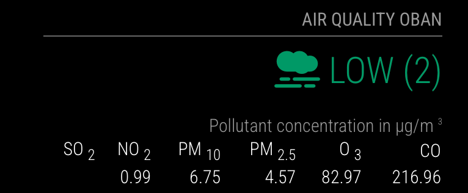

# MMM-AirQuality
 MagicMirror² module to display Air Pollution data from OpenWeatherMap.org


# MMM-AirQuality




[Module description]

## Installation

### Install

In your terminal, go to your [MagicMirror²][mm] Module folder and clone MMM-AirQuality:

```bash
cd ~/MagicMirror/modules
git clone https://github.com/bluerhodfa/MMM-AirQuality.git
mpm install
```

### Update

```bash
cd ~/MagicMirror/modules/MMM-AirQuality
git pull
```

## Using the module

To use this module, add it to the modules array in the `config/config.js` file:

```js
    {
        module: 'MMM-Template',
        position: 'lower_third'
    },
```

Or you could use all the options:

```js
{
 			module: "MMM-AirQuality",
  			position: "top_right",
  			config: {
    			appId: "{your openweathermap api key}",
				location: "Oban",                   // Location
    			lat: "56.4127",		                // Latitude of your location (Oban in this example)
    			lon: "-5.4706",                     // Longitude of your location
    			showPM10: true,                     // Show PM10 data
    			showPM25: true,                     // Show PM2.5 data
    			updateInterval: 3600000,            // Update every hour ( ambee has 100 calls a day. and app uses 3 endpoints so lowest updateInterval is : ~2,618,181 milliseconds (about 43.6 minutes). )
    			animationSpeed: 1000,               // 1 second for DOM animations
    			showPollenForecast: true,           // Control pollen forecast display
    			showGrassPollen: true,              // Option to show or hide Grass pollen
    			showTreePollen: true,               // Option to show or hide Tree pollen
    			showWeedPollen: true,               // Option to show or hide Weed pollen
    			startsilentHour: 21,                // Begin ignore period at 21:00
    			endsilentHour: 7,                   // End ignore period at 07:00
    			debug: false                        // Set to true to enable logging for debugging
  		}
		},
```

## Configuration options

Option|Possible values|Default|Description
------|------|------|-----------
`exampleContent`|`string`|not available|The content to show on the page

## Sending notifications to the module

Notification|Description
------|-----------
`TEMPLATE_RANDOM_TEXT`|Payload must contain the text that needs to be shown on this module

## Developer commands

- `npm install` - Install devDependencies like ESLint.
- `npm run lint` - Run linting and formatter checks.
- `npm run lint:fix` - Fix linting and formatter issues.

[mm]: https://github.com/MagicMirrorOrg/MagicMirror
